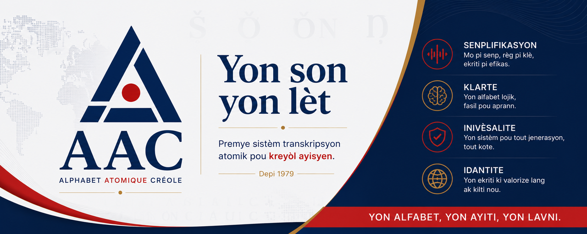

# ACC — Alphabet Atomique Créole

Bienvenue sur le dépôt officiel du projet **ACC (Alphabet Atomique Créole)**.

Ce dépôt rassemble :

- **Le livre complet** (au format PDF) : *« Pour une Rationalisation Atomique de la Graphie Créole Haïtienne — De la Réforme Orthographique de 1979 à l'Alphabet Atomique Créole »*.
- **Le toolkit technique** : un convertisseur bidirectionnel, une démo web interactive, une disposition clavier, et des tests automatisés.

---

## Contenu du dépôt
| Élément                                                                                 | Description |
|:----------------------------------------------------------------------------------------| :--- |
| 📄 [`Alphabet Atomique Creole Livre - v1.2.0`](https://doi.org/10.5281/zenodo.21540458) | Le mémoire complet, version livre (6×9 po). |
| 🧰 [`toolkit/`](./toolkit/)                                                              | Le toolkit ACC, toujours à jour sur `main` (convertisseur, démo web, jeux de pratique, clavier, tests). |
| 🏷️ [Toutes les versions (tags)](https://github.com/lincoln509/aac/tags)                | Historique des versions du toolkit (`v1.0.0`, `v1.0.1`, `v1.1.0`, `v1.1.1`, ...). |

---

## À propos du livre

Le livre détaille la théorie derrière l'ACC : un alphabet rationalisé pour le créole haïtien, réduisant l'inventaire de 32 à 24 lettres atomiques. Il contient l'historique, la justification linguistique, le protocole d'implémentation, les résultats chiffrés et des annexes complètes.

[//]: # (➡️ **Accéder au livre :** [`Alphabet Atomique Creole Livre - v1.2.0.pdf`]&#40;./Alphabet%20Atomique%20Creole%20Livre%20-%20v1.2.0.pdf&#41;)
➡️ **Accéder au livre :** [`Alphabet Atomique Creole Livre - v1.2.0`](https://doi.org/10.5281/zenodo.21540458)

---

## À propos du toolkit

Le toolkit est une implémentation technique de la réforme proposée. Il comprend :

- **Un convertisseur** (Python / JavaScript) entre l'orthographe officielle de 1979 et l'ACC.
- **Une démo web** interactive (éditeur à deux panneaux, conversion en temps réel).
- **Une disposition clavier** pour taper `š`, `ŏ` et `ŋ` facilement.
- **Une suite de tests** qui reproduit les chiffres du mémoire (gain de 2,5 % à 9,3 % selon le texte — moyenne 5,7 %, IC95 % [3,9–7,5 %] sur 8 textes indépendants —, réduction à 127 caractères pour l'extrait historique, etc.).

➡️ **Accéder au toolkit :** [`toolkit/`](./toolkit/) — consultez son README pour l'installation et l'utilisation.

---

## Versions du toolkit

Le toolkit vit dans un seul dossier [`toolkit/`](./toolkit/), toujours à jour sur `main` — il n'y a pas de dossiers séparés par version (`toolkit/v1.1.0/`, etc.). L'historique des versions est disponible uniquement via les [tags Git](https://github.com/lincoln509/aac/tags) :

- `v1.0.0`, `v1.0.1` — version initiale (convertisseur, démo, clavier, tests).
- `v1.1.0` — ajout de la conversion de documents Word/PDF entiers avec rapport statistique.
- `v1.1.1` — jeux de pratique orthographique AAC, corpus de validation élargi à 8 textes indépendants.

Pour consulter une version précédente : `https://github.com/lincoln509/aac/tree/<tag>/toolkit` (ex. [`v1.1.0/toolkit`](https://github.com/lincoln509/aac/tree/v1.1.0/toolkit)).

---

## Licence

- **Code** (toolkit) : licence [MIT](./toolkit/LICENSE).
- **Livre** : licence propre (voir le PDF).

---

## Auteur

**Harcot Lincoln Compère**  
[lincolncompere@gmail.com](mailto:lincolncompere@gmail.com)

---

*Ce dépôt est la vitrine d'un projet de recherche indépendant. Contributions et retours bienvenus via les issues GitHub.*
